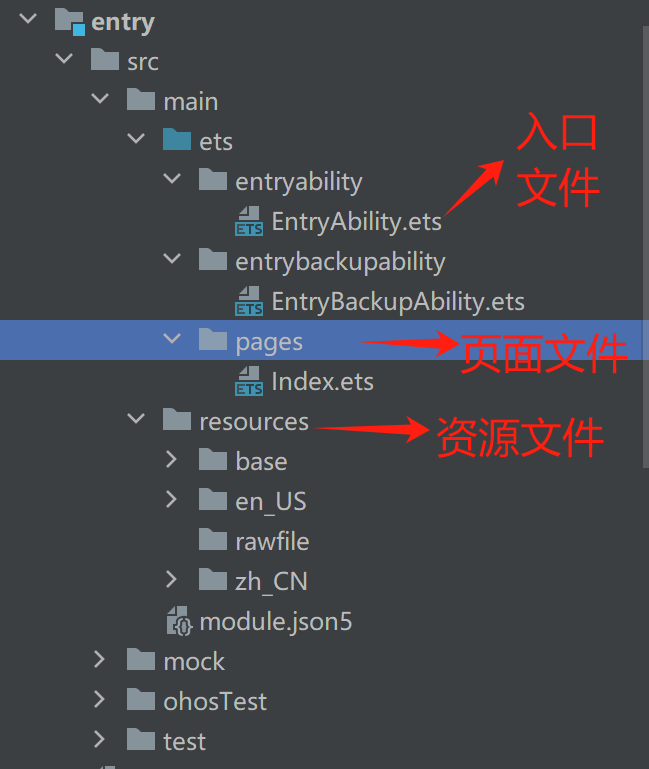
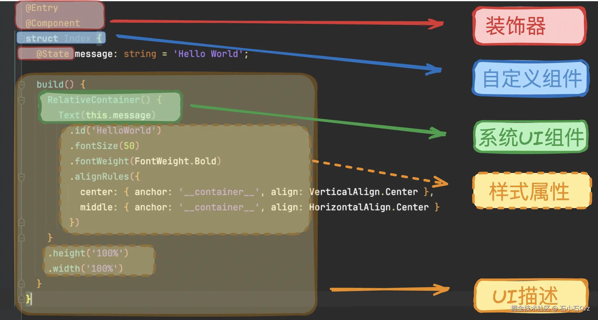

# 鸿蒙 ArkUI 开发入门经验分享

---

## 介绍

最新版本的鸿蒙系统已经剔除了安卓（AOSP），即不再支持安卓原生 app ，只支持鸿蒙 app 。也就是说以后每款手机 app 都得开发三个版本：Android、iOS、鸿蒙。鸿蒙也要建立和安卓苹果一样的生态，不管是从鸿蒙自身还是国家政治层面上，都是大势所趋，包括以后咱们公司的 app 也得多打包个鸿蒙版本。所以咱们还是非常有必要了解一下的。

目前鸿蒙 app 的开发方式有：

- 原生 ArkTS + ArkUI
- 类 Web 开发 (JS)
- uni-app
- Flutter

我也是刚学习鸿蒙开发不久，正好又中奖，就借此机会给大家分享一下我学习的经验，带大家过一下鸿蒙 app 的大致开发流程和学习方法，好让大家有个了解。

---

## 开发环境准备
1. 下载 IDE DevEco：https://developer.huawei.com/consumer/cn/download/
   * windows 启动模拟器需要的额外步骤：https://developer.huawei.com/consumer/cn/doc/harmonyos-guides-V5/ide-emulator-faqs-V5#section172728114485
2. 下载模拟器
3. 启动示例程序
4. 官方文档
   * 开发文档：https://developer.huawei.com/consumer/cn/doc/harmonyos-guides-V5/application-dev-guide-V5
   * API 文档：https://developer.huawei.com/consumer/cn/doc/harmonyos-references-V5/development-intro-api-V5?catalogVersion=V5

---

## 项目结构介绍

---

## 示例代码解析

---

- 官方视频教程：https://developer.huawei.com/consumer/cn/training/
- 开发者认证：https://developer.huawei.com/consumer/cn/training/dev-certification/a617e0d3bc144624864a04edb951f6c4
- 官方论坛：https://developer.huawei.com/consumer/cn/forum/

- https://juejin.cn/post/7366948087129309220?searchId=20240829174844D43BBF96B02FE40FA088
- https://juejin.cn/post/7397639310722531362
- https://juejin.cn/post/7393606971927478287
- https://developer.huawei.com/consumer/cn/develop/